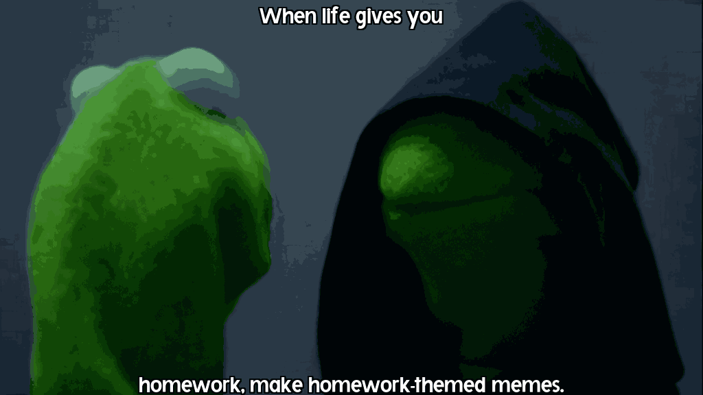
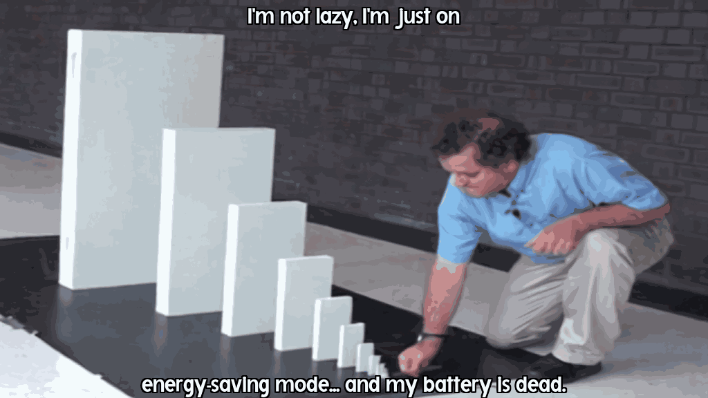
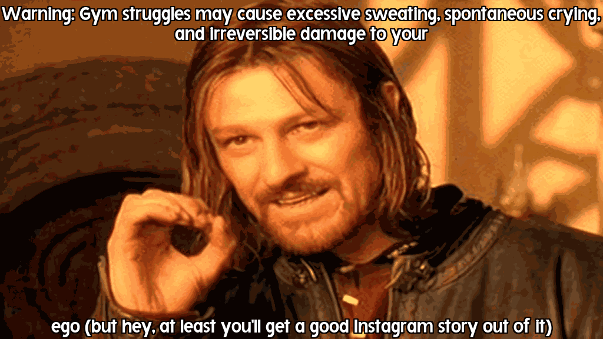
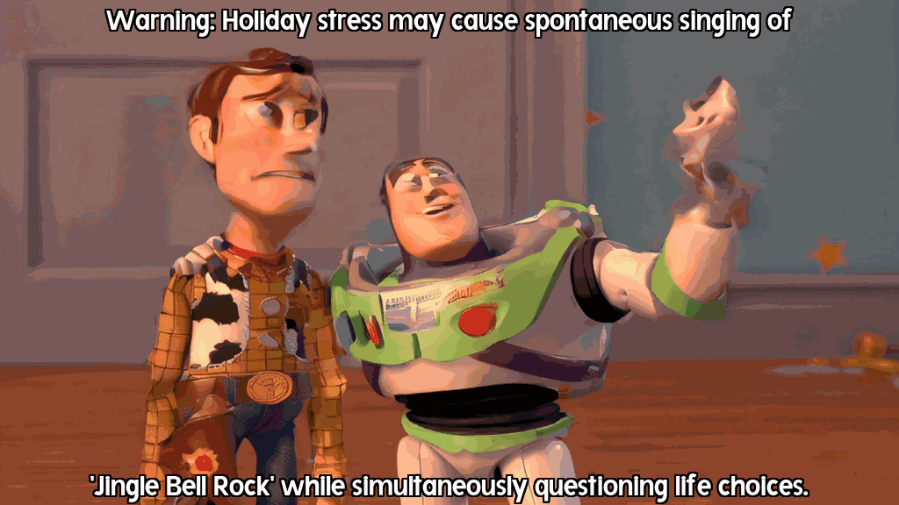
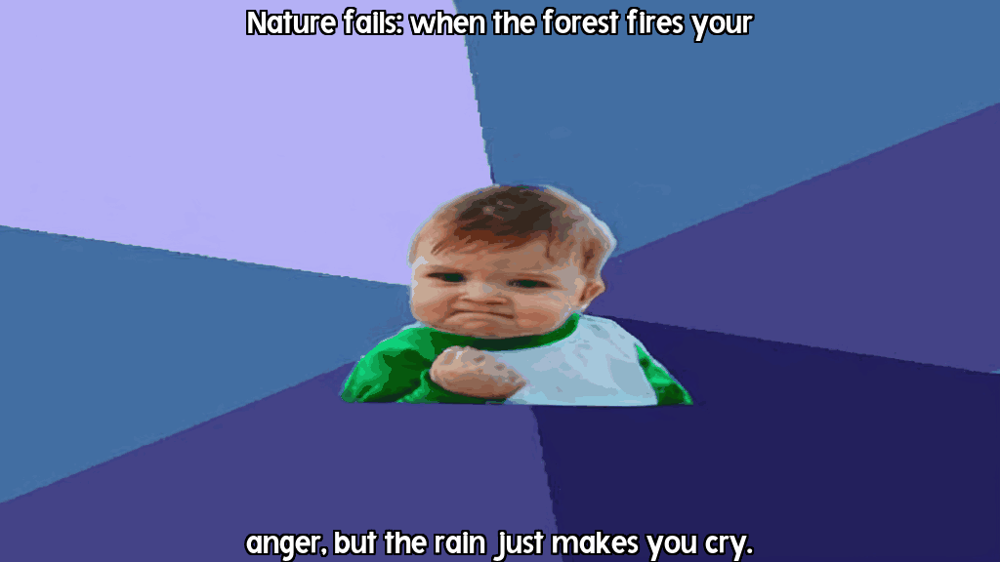

# 🎬 AI-Powered Meme GIF Generator

> Transform any prompt into hilarious animated memes using cutting-edge AI models!

[](https://python.org)
[](LICENSE)
[](CONTRIBUTING.md)

This project implements a comprehensive framework for creating animated GIFs from user prompts using advanced AI models. The system generates humorous and contextually relevant meme content by combining state-of-the-art text generation, image synthesis, and video diffusion technologies.

---

## 🚀 Features

- **🤖 AI-Powered Text Generation**: Uses Llama 3.2 (3B-Instruct) for witty meme captions
- **🎯 Smart Template Matching**: Semantic similarity search for optimal meme template selection  
- **🎥 Video Synthesis**: Stable Video Diffusion for smooth, high-quality GIF generation
- **✨ Dynamic Text Overlay**: Intelligent text positioning with customizable styling
- **📊 Batch Processing**: Generate multiple memes efficiently
- **🔧 Configurable Pipeline**: Easy customization of models and parameters

---

## 🏗️ Architecture Overview

Our pipeline consists of five main components:

1. **User Prompt Processing**: Natural language input parsing and preprocessing
2. **Meme Text Generation**: AI-powered caption creation using Llama 3.2
3. **Template Selection**: Semantic matching with pre-existing meme templates
4. **Video Generation**: Frame-by-frame animation using Stable Video Diffusion
5. **Text Overlay**: Dynamic caption positioning and styling

---AI-Powered Meme GIF Generator

This project implements a framework for creating GIFs from user prompts using advanced AI models. The generated GIFs use humorous or insightful captions to create meme-like content based on the user’s input.

---

## Overview

Our pipeline consists of:
1. **User Prompt**: The user provides a topic or input idea.
2. **Text Generation**: An NLP model, Llama 3.2 (3B - instructed), generates a meme-like caption for the provided prompt.
3. **Meme Template Selection**: A meme template is chosen from a pre-existing database (e.g., Imgflip).
4. **GIF Generation**: Using stable video diffusion, 14 frames are created to form a looping video.
5. **Text Overlay System**: The caption is overlaid onto the generated frames to finalize the GIF.

---

## 📊 Pipeline Visualization

### System Architecture
The MemeCraft framework demonstrates our end-to-end approach from prompt to meme:


*Figure 1: Complete pipeline showing template selection, caption generation, and text overlay process*

### System Flow Diagram
Our high-level system architecture illustrates the seamless integration of AI models:


*Figure 2: System architecture from user input to final animated meme generation*

### Example Results and Performance
Real-world examples showcasing the variety and quality of generated content:


*Figure 3: Sample prompts with corresponding generated captions and resulting GIFs*

---

## 🎯 Example Generated GIFs

Here are some examples of prompts and the AI-generated animated GIFs:

### 1. Classic Reaction Meme


### 2. Relatable Situation


### 3. Pop Culture Reference


### 4. Daily Life Humor


### 5. Internet Culture


---

## 📁 Project Structure

```
gif_maker_AI/
├── 📁 src/                          # Source code
│   ├── 📄 __init__.py               # Package initialization
│   ├── 📄 main.py                   # Main pipeline script
│   ├── 📁 core/                     # Core functionality
│   │   ├── 📄 __init__.py
│   │   ├── 📄 meme_generator.py     # Main meme generation logic
│   │   ├── 📄 video_generator.py    # Video diffusion pipeline
│   │   └── 📄 image_generator.py    # Image generation utilities
│   └── 📁 utils/                    # Utility modules
│       ├── 📄 __init__.py
│       ├── 📄 text_overlay.py       # Text positioning and styling
│       ├── 📄 similarity.py         # Text similarity calculations
│       └── 📄 template_search.py    # Template matching algorithms
├── 📁 data/                         # Data files
│   ├── 📄 meme_text_description.json      # Template descriptions
│   ├── 📄 meme_text_description_new.json  # Updated template data
│   └── 📄 meme_templates.zip        # Compressed meme templates
├── 📁 output/                       # Generated content
│   ├── 📁 frames/                   # Individual video frames
│   └── 📁 gifs/                     # Final GIF outputs
├── 📁 config/                       # Configuration files
│   └── 📄 settings.py               # Application settings
├── 📁 images_for_readme/            # Documentation assets
├── 📄 requirements.txt              # Python dependencies
├── 📄 setup.py                      # Package setup configuration
└── 📄 README.md                     # This file
```

---

## 🛠️ Technology Stack

### AI Models
- **🧠 Text Generation**: [Llama 3.2 (3B-Instruct)](https://huggingface.co/meta-llama/Llama-3.2-3B-Instruct) - Advanced language model for meme caption generation
- **🔍 Semantic Search**: [all-MiniLM-L6-v2](https://huggingface.co/sentence-transformers/all-MiniLM-L6-v2) - Efficient sentence embeddings for template matching
- **🖼️ Image Generation**: [Stable Diffusion XL](https://huggingface.co/stabilityai/stable-diffusion-xl-base-1.0) - High-quality image synthesis
- **🎬 Video Diffusion**: [Stable Video Diffusion](https://huggingface.co/stabilityai/stable-video-diffusion-img2vid) - Image-to-video generation

### Core Technologies
- **PyTorch** - Deep learning framework
- **Diffusers** - State-of-the-art diffusion models
- **Transformers** - Pre-trained transformer models
- **Sentence Transformers** - Semantic text similarity
- **FAISS** - Efficient similarity search
- **Pillow** - Image processing and manipulation

---

## ⚡ Quick Start

### Prerequisites
- Python 3.8+
- CUDA-compatible GPU (recommended)
- 8GB+ RAM
- 10GB+ free disk space

### 1. Installation

```bash
# Clone the repository
git clone https://github.com/Roy-Ayalon/gif_maker_AI.git
cd gif_maker_AI

# Install dependencies
pip install -r requirements.txt

# Alternative: Install as a package
pip install -e .
```

### 2. Configuration

Create your environment file or update `config/settings.py`:

```python
# Required API Keys
GENAI_API_KEY = "your_google_generative_ai_api_key"
HUGGINGFACE_TOKEN = "your_huggingface_token"
```

### 3. Basic Usage

```bash
# Run the main pipeline
python src/main.py

# Or run individual components
python src/core/meme_generator.py --prompt "Monday mornings"
```

### 4. Advanced Usage

```python
from src.core.meme_generator import MemeGenerator

# Initialize the generator
generator = MemeGenerator()

# Generate a single meme
gif_path = generator.generate_meme("coffee addiction")

# Batch generation
prompts = ["Monday blues", "WiFi issues", "Cat videos"]
results = generator.batch_generate(prompts)
```

---

## 🔧 Configuration

### Model Parameters

You can customize the generation process by modifying `config/settings.py`:

```python
# Generation Parameters
DEFAULT_NUM_FRAMES = 14              # Number of video frames
DEFAULT_INFERENCE_STEPS = 100        # Diffusion steps (quality vs speed)
DEFAULT_HEIGHT = 512                 # Output height
DEFAULT_WIDTH = 512                  # Output width
DEFAULT_GIF_DURATION = 200          # Frame duration in milliseconds

# Text Overlay Settings
DEFAULT_FONT_SIZE = 30               # Base font size
DEFAULT_OUTLINE_THICKNESS = 1        # Text outline thickness
DEFAULT_TEXT_COLOR = (255, 255, 255) # White text
DEFAULT_OUTLINE_COLOR = (0, 0, 0)    # Black outline
```

### Environment Variables

For production deployment, use environment variables:

```bash
export GENAI_API_KEY="your_api_key"
export HUGGINGFACE_TOKEN="your_token"
export CUDA_VISIBLE_DEVICES="0"  # GPU selection
```

---

## 🐛 Troubleshooting

### Common Issues

**CUDA Out of Memory Error**
```bash
# Solution 1: Enable CPU offloading
export PYTORCH_CUDA_ALLOC_CONF=expandable_segments:True

# Solution 2: Reduce batch size and resolution
DEFAULT_HEIGHT = 256
DEFAULT_WIDTH = 256
```

**Model Download Issues**
```bash
# Clear Hugging Face cache
rm -rf ~/.cache/huggingface/

# Re-login to Hugging Face
huggingface-cli login
```

**Slow Generation Speed**
- Ensure CUDA is properly installed
- Use GPU-optimized models
- Enable xFormers memory efficient attention

### FAQ

**Q: Can I use custom meme templates?**
A: Yes! Add your templates to `data/` and update the JSON descriptions.

**Q: How do I change the text generation model?**
A: Modify `TEXT_GENERATION_MODEL` in `config/settings.py`.

**Q: Can I run this on CPU only?**
A: Yes, but expect significantly slower generation times (10-20x slower).

---
## 📈 Roadmap

### Version 1.1 (Coming Soon)
- [ ] Web interface with real-time preview
- [ ] Custom font upload support
- [ ] Batch processing with progress tracking
- [ ] Advanced text positioning algorithms

### Version 1.2 (Future)
- [ ] Voice-to-meme generation
- [ ] Multi-language support
- [ ] Social media integration
- [ ] Community template sharing

### Version 2.0 (Long-term)
- [ ] Real-time meme generation
- [ ] AI-powered meme trend analysis
- [ ] Custom model fine-tuning
- [ ] Mobile app development

---


**Made with ❤️ by [Roy Ayalon](https://github.com/Roy-Ayalon)**

*Bringing AI-powered humor to the world, one meme at a time!* 🎭

[⬆ Back to Top](#-ai-powered-meme-gif-generator)

</div>
